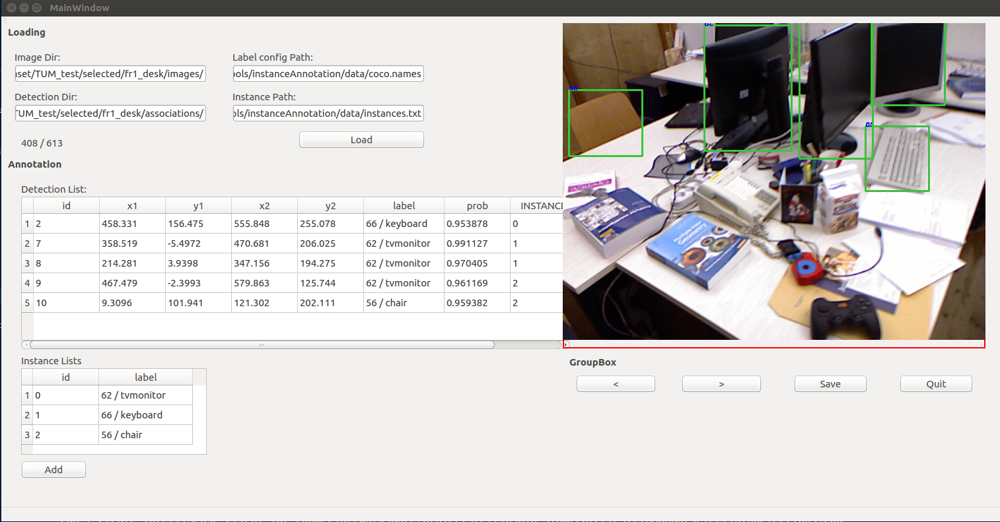

# Introduction
For the semantic object-level SLAM, we need to solve the data associations of the bounding boxes generated from object detector (eg. Yolo) between frames.

This project aims at building a convenient tool for annotating data association. The User Interface is built upon Qt. 

# Example
Build it.
Run the excutable binary file.

It's friendly for annotating. Just like this:

# Change by yourself
Load it in Qt Creator from .pro file. Then play it as you like.

# TODO
[ ] Automatic data association: 
It's too much for human annotation alone. Let machine help you.

[ ] Visualization: Show the asssociation better with text, rectangle and something else on the images.

Welcome to join me!
